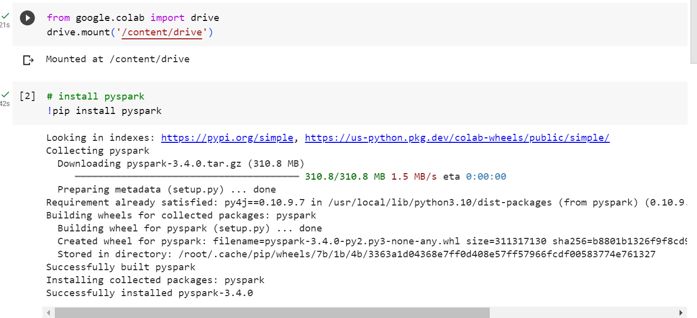
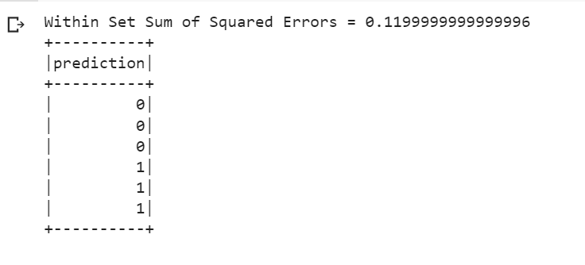

# TUGAS BIG DATA SPARK MACHINE LEARNING

Nama : Karmila Novi Arfiana

Kelas : TI 3C / 09

NIM : 2041720073

#
1. PPT HAL 30 (MOVIE LENS RECOMMENDATION)

    - Akses dataset / file, kemudian install pyspark.
    

    - import library pyspark.ml, dan pyspark.sql. Kemudian read file ratings.dat pada google drive. kemudian lakukan RDD mapping.
    

    - Membuat model rekomendasi menggunakan ALS pada training data yang sebelumnya sudah dibuat
    
    - Output
    

2. PPT HAL 48 

    - Akses google drive, kemudian install pyspark 
    
    

    - Mengubah data ratings.dat mejadi objek Rating dan data baru ditambahkan ke RDD. model digunakan untuk merekomendasikan 10 produk kepada pengguna.
    
    - Output
    

3. PPT HAL 49

     - Menampilkan statistik summary mulai dari rata", varian, dll dari vectorRdd rating yang telah di proses sebelumnya. 
     

4. PPT HAL 52
    - Melakukan klastering dengan algoritma K-means, dengan data diubah menjadi vektor, kemudian model k-means ditrain dan digunakan untuk melakukan prediksi klaster. Lalu hasil within set sum of squared errors (wssse) dihitung dan di cetak.
    
    - Output 
    

5. PPT HAL 53 - 54
    - Melakukan klastering dengan K-means, data dibaca dan buat menjadi array, kemudian K-means dibuat untuk mengklasterkan data ke dalam dua klaster. Lalu menghitung within set sum of squared errors. 
    
    - Setelah berhasil, maka akan tampil berbentuk file clusters yang telah disimpan pada folder yulia_path
    